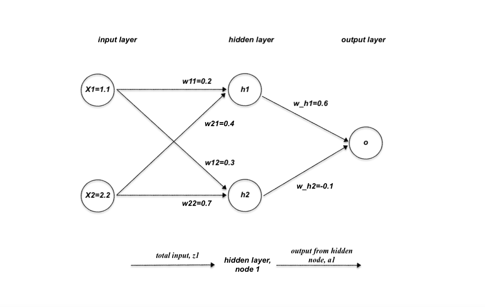

# Neural Network - Backpropagation

Here's a detailed walkthrough of a simple neural network learning $\( y = x_1 + x_2 \)$ using backpropagation.

### Neural Network Structure
1. **Input Layer**: $\( x_1 = 1.1 \), \( x_2 = 2.2 \)$
2. **Hidden Layer**: Two nodes with sigmoid activation
   - Weights: $\( w_{11} = 0.2 \), \( w_{12} = 0.3 \), \( w_{21} = 0.4 \), \( w_{22} = 0.7 \)$ 
3. **Output Layer**: One node with sigmoid activation
   - Weights: $\( w_{h1} = 0.6 \), \( w_{h2} = -0.1 \)$
4. **Target Output**: $\( y = x_1 + x_2 = 1.1 + 2.2 = 3.3 \)$
5. **Learning Rate** $\( \eta = 0.1 \)$
6. **No Biases**

#### Activation Function
The sigmoid function:

$$
\sigma(z) = \frac{1}{1 + e^{-z}}
$$

Derivative:

$$
\sigma'(z) = \sigma(z)(1 - \sigma(z))
$$

### Step 1: Forward Pass
#### Hidden Layer Calculations
For the first hidden node:

$$
z_1 = x_1 \cdot w_{11} + x_2 \cdot w_{21} = 1.1 \cdot 0.2 + 2.2 \cdot 0.4 = 0.22 + 0.88 = 1.1
$$

$$
a_1 = \sigma(z_1) = \frac{1}{1 + e^{-1.1}} \approx 0.75026
$$

For the second hidden node:

$$
z_2 = x_1 \cdot w_{12} + x_2 \cdot w_{22} = 1.1 \cdot 0.3 + 2.2 \cdot 0.7 = 0.33 + 1.54 = 1.87
$$

$$
a_2 = \sigma(z_2) = \frac{1}{1 + e^{-1.87}} \approx 0.86607
$$

#### Output Layer Calculations

$$
z_o = a_1 \cdot w_{h1} + a_2 \cdot w_{h2} = 0.75026 \cdot 0.6 + 0.86607 \cdot (-0.1) = 0.45016 - 0.08661 = 0.36355
$$

$$
y_{\text{pred}} = \sigma(z_o) = \frac{1}{1 + e^{-0.36355}} \approx 0.58989
$$

### Step 2: Loss Calculation
Using Mean Squared Error (MSE):

$$
\text{Loss} = \frac{1}{2} (y_{\text{pred}} - y)^2 = \frac{1}{2} (0.58989 - 3.3)^2 \approx 3.67545
$$

### Step 3: Backward Pass
#### Output Layer Gradients
Error gradient with respect to $\( z_o \)$:

$$
\delta_o = (y_{\text{pred}} - y) \cdot \sigma'(z_o) = (0.58989 - 3.3) \cdot (0.58989 \cdot (1 - 0.58989)) 
$$

$$
\delta_o \approx -2.71011 \cdot 0.242
$$

$$
\delta_o \approx -0.65584
$$

Gradients for weights $\( w_{h1} \)$ and $\( w_{h2} \)$:

$$
\frac{\partial \text{Loss}}{\partial w_{h1}} = \delta_o \cdot a_1 = -0.65584 \cdot 0.75026 \approx -0.49198
$$

$$
\frac{\partial \text{Loss}}{\partial w_{h2}} = \delta_o \cdot a_2 = -0.65584 \cdot 0.86607 \approx -0.56795
$$

#### Hidden Layer Gradients
Error gradients for hidden nodes:

$$
\delta_1 = \delta_o \cdot w_{h1} \cdot \sigma'(z_1) = -0.65584 \cdot 0.6 \cdot (0.75026 \cdot (1 - 0.75026)) 
$$

$$
\delta_1 \approx -0.39350 \cdot 0.1875 \approx -0.07382
$$

$$
\delta_2 = \delta_o \cdot w_{h2} \cdot \sigma'(z_2) = -0.65584 \cdot (-0.1) \cdot (0.86607 \cdot (1 - 0.86607)) 
$$

$$
\delta_2 \approx 0.06558 \cdot 0.1158 \approx 0.00760
$$

Gradients for weights $\( w_{11}, w_{21}, w_{12}, w_{22} \)$:

$$
\frac{\partial \text{Loss}}{\partial w_{11}} = \delta_1 \cdot x_1 = -0.07382 \cdot 1.1 \approx -0.08120
$$

$$
\frac{\partial \text{Loss}}{\partial w_{21}} = \delta_1 \cdot x_2 = -0.07382 \cdot 2.2 \approx -0.16241
$$

$$
\frac{\partial \text{Loss}}{\partial w_{12}} = \delta_2 \cdot x_1 = 0.00760 \cdot 1.1 \approx 0.00836
$$

$$
\frac{\partial \text{Loss}}{\partial w_{22}} = \delta_2 \cdot x_2 = 0.00760 \cdot 2.2 \approx 0.01672
$$

### Step 4: Weight Update
Using learning rate $\( \eta = 0.1 \)$:

$$
w_{h1} \leftarrow w_{h1} - \eta \cdot \frac{\partial \text{Loss}}{\partial w_{h1}} = 0.6 - 0.1 \cdot (-0.49198) \approx 0.6492
$$

$$
w_{h2} \leftarrow w_{h2} - \eta \cdot \frac{\partial \text{Loss}}{\partial w_{h2}} = -0.1 - 0.1 \cdot (-0.56795) \approx -0.0432
$$

$$
w_{11} \leftarrow w_{11} - \eta \cdot \frac{\partial \text{Loss}}{\partial w_{11}} = 0.2 - 0.1 \cdot (-0.08120) \approx 0.2081
$$

$$
w_{21} \leftarrow w_{21} - \eta \cdot \frac{\partial \text{Loss}}{\partial w_{21}} = 0.4 - 0.1 \cdot (-0.16241) \approx 0.4162
$$

$$
w_{12} \leftarrow w_{12} - \eta \cdot \frac{\partial \text{Loss}}{\partial w_{12}} = 0.3 - 0.1 \cdot (0.00836) \approx 0.2992
$$

$$
w_{22} \leftarrow w_{22} - \eta \cdot \frac{\partial \text{Loss}}{\partial w_{22}} = 0.7 - 0.1 \cdot (0.01672) \approx 0.6983
$$

### Summary of Updated Weights
- $\( w_{11} \approx 0.2081 \), \( w_{21} \approx 0.4162 \)$
- $\( w_{12} \approx 0.2992 \), \( w_{22} \approx 0.6983 \)$
- $\( w_{h1} \approx 0.6492 \), \( w_{h2} \approx -0.0432 \)$

This process would be repeated for subsequent epochs until convergence.

## Appendix 1 - The gradient of the loss $\( \delta_o \)$

The term $\( \delta_o \)$, often referred to as the **delta** or **error term** for the output layer, represents the gradient of the loss with respect to the input to the output layer $\( z_o \)$. This term is used during backpropagation to update the weights and biases of the neural network.

### Step-by-Step Derivation of $\( \delta_o \)$:

#### 1. **Loss Function**:

In a neural network, the most common loss function for a binary classification problem is **mean squared error (MSE)** or **cross-entropy loss**. Let’s first go over the derivation for the **MSE** case.

The **Mean Squared Error (MSE)** loss function is:

$$
L = \frac{1}{2} (y_{\text{pred}} - y)^2
$$

Where:
- $\( y_{\text{pred}} = \sigma(z_o) \)$ is the predicted output after applying the activation function (sigmoid in this case).
- $\( y \)$ is the true label or target value.

We use this loss function to compute the gradient during backpropagation.

#### 2. **Gradient of the Loss with Respect to $\( y_{\text{pred}} \)$**:

To find $\( \delta_o \)$, we start by computing the gradient of the loss $\( L \)$ with respect to the predicted output $\( y_{\text{pred}} \)$. We take the derivative of the MSE loss:

$$
\frac{\partial L}{\partial y_{\text{pred}}} = \frac{\partial}{\partial y_{\text{pred}}} \left( \frac{1}{2} (y_{\text{pred}} - y)^2 \right)
$$

Using the chain rule:

$$
\frac{\partial L}{\partial y_{\text{pred}}} = (y_{\text{pred}} - y)
$$

#### 3. **Gradient of the Activation Function**:

Next, we compute the derivative of the activation function $\( \sigma(z_o) \)$ with respect to $\( z_o \)$. The activation function is typically the **sigmoid function**:

$$
\sigma(z_o) = \frac{1}{1 + e^{-z_o}}
$$

The derivative of the sigmoid function with respect to $\( z_o \)$ is:

$$
\sigma'(z_o) = \sigma(z_o) \cdot (1 - \sigma(z_o)) = y_{\text{pred}} \cdot (1 - y_{\text{pred}})
$$

#### 4. **Computing $\( \delta_o \)$**:

Now, we use the **chain rule** to compute $\( \delta_o \)$, the gradient of the loss with respect to $\( z_o \)$. The error term $\( \delta_o \)$ for the output layer is the product of:
- The gradient of the loss with respect to $\( y_{\text{pred}} \)$, which is $\( (y_{\text{pred}} - y) \)$.
- The gradient of the activation function $\( \sigma'(z_o) \)$, which is $\( y_{\text{pred}} \cdot (1 - y_{\text{pred}}) \)$.

Thus, we get:

$$
\delta_o = \frac{\partial L}{\partial z_o} = \frac{\partial L}{\partial y_{\text{pred}}} \cdot \frac{\partial y_{\text{pred}}}{\partial z_o}
$$

Substituting the results we computed:

$$
\delta_o = (y_{\text{pred}} - y) \cdot y_{\text{pred}} \cdot (1 - y_{\text{pred}})
$$

This is the error term at the output layer. 

### Summary:

- **$\( \delta_o \)$** (the error term at the output layer) is calculated as:

$$
\delta_o = (y_{\text{pred}} - y) \cdot y_{\text{pred}} \cdot (1 - y_{\text{pred}})
$$

Where:
- $\( y_{\text{pred}} = \sigma(z_o) \)$ is the predicted output from the sigmoid activation.
- $\( y \)$ is the true target value (the label).
- $\( \sigma'(z_o) = y_{\text{pred}} \cdot (1 - y_{\text{pred}}) \)$ is the derivative of the sigmoid function.

### Why is this important?

The term $\( \delta_o \)$ is used in backpropagation to update the weights and biases of the neural network by propagating the error backward through the network. It helps compute how much each weight in the output layer contributed to the error, and this information is then used to adjust the weights accordingly.

## Appendix 2 - The gradient of the **loss function** with respect to the **weight** 

The equation:

$$
\frac{\partial \text{Loss}}{\partial w_{h1}} = \delta_o \cdot a_1
$$

represents the gradient of the **loss function** with respect to the **weight** $\( w_{h1} \)$ between the first hidden neuron $\( a_1 \)$ and the output neuron $\( z_0 $, the input to the output layer). This is a crucial part of the **backpropagation** process, where we compute how much the loss changes with respect to the weights of the network, so we can update them during training.

### Let’s break it down:

#### 1. **Forward Propagation**:
In a simple feedforward neural network with one hidden layer, during forward propagation:
- The output of the first hidden neuron $\( a_1 \)$ is computed based on the input features $\( x \)$ and the weights of the hidden layer, as:

$$
a_1 = \sigma(z_1) = \sigma(w_{h1} \cdot x_1 + w_{h2} \cdot x_2 + \dots + b_1)
$$

where $\( \sigma \)$ is the activation function (e.g., sigmoid, ReLU), and $\( w_{h1}, w_{h2}, \dots \)$ are the weights of the hidden layer.

The output of the network $\( y_{\text{pred}} \)$ is then calculated using the weighted sum of the hidden neuron outputs, and passed through the output layer's activation function $\( \sigma_o \)$.

$$
z_o = w_{o1} \cdot a_1 + w_{o2} \cdot a_2 + b_o
$$

$$
y_{\text{pred}} = \sigma_o(z_o)
$$

#### 2. **Backpropagation**:
Backpropagation involves computing the gradient of the loss function with respect to the network’s weights. The error gradients allow us to update the weights using an optimization algorithm like gradient descent.

To calculate the gradient of the loss with respect to the weight $\( w_{h1} \)$, we need to apply the chain rule. Here's how the terms break down:

##### a. **Error term at the output layer $(\( \delta_o \))$**:
The first step in backpropagation is to compute the **error term** at the output layer $\( \delta_o \)$. This error term represents how much the output of the network $(\( y_{\text{pred}} \))$ differs from the true target value $\( y \)$.

For a neural network with a sigmoid activation function at the output layer and a mean squared error (MSE) loss, we can compute $\( \delta_o \)$ as:

$$
\delta_o = (y_{\text{pred}} - y) \cdot y_{\text{pred}} \cdot (1 - y_{\text{pred}})
$$

This term tells us how much the output layer’s weighted input $\( z_o \)$ needs to be adjusted to reduce the loss.

##### b. **Gradient with respect to $\( w_{h1} \)$**:
Now we want to calculate the gradient of the loss with respect to the weight $\( w_{h1} \)$, which connects the first hidden neuron $\( a_1 \)$ to the output neuron.

- **Step 1**: Apply the **chain rule**:
  
 $$
  \frac{\partial \text{Loss}}{\partial w_{h1}} = \frac{\partial \text{Loss}}{\partial z_o} \cdot \frac{\partial z_o}{\partial w_{h1}}
  $$

- **Step 2**: Break down the individual terms:
  - The term $\( \frac{\partial \text{Loss}}{\partial z_o} \)$ is simply $\( \delta_o \)$, the error term at the output layer.
  - The term $\( \frac{\partial z_o}{\partial w_{h1}} \)$ is the derivative of $\( z_o \)$ with respect to the weight $\( w_{h1} \)$, which is $\( a_1 \)$, the activation of the first hidden (since ( $z_o = w_{o1} \cdot a_1 + \dots$ )).

Thus:

$$
\frac{\partial \text{Loss}}{\partial w_{h1}} = \delta_o \cdot a_1
$$

This gives us the gradient of the loss with respect to $\( w_{h1} \)$, which is used in the gradient descent update rule to adjust the weight $\( w_{h1} \)$.

#### 3. **Gradient Descent Update**:
Once we have the gradient $\( \frac{\partial \text{Loss}}{\partial w_{h1}} \)$, we can use it to update the weight $\( w_{h1} \)$ using an optimization algorithm, typically **gradient descent**:

$$
w_{h1} \leftarrow w_{h1} - \eta \cdot \frac{\partial \text{Loss}}{\partial w_{h1}}
$$

Where:
- $\( \eta \)$ is the **learning rate**, controlling the size of the update step.

### Summary of the Gradient Computation:

1. **Compute $\( \delta_o \)$**, the error term at the output layer:

$$
\delta_o = (y_{\text{pred}} - y) \cdot y_{\text{pred}} \cdot (1 - y_{\text{pred}})
$$

2. **Compute the gradient of the loss with respect to $\( w_{h1} \)$**:

$$
\frac{\partial \text{Loss}}{\partial w_{h1}} = \delta_o \cdot a_1
$$

This represents how much the loss changes with respect to the weight $\( w_{h1} \)$, which allows us to update the weight and reduce the error during training.

---

[Watch the Youtube video here](https://youtu.be/q-GBQTs0fsE)

